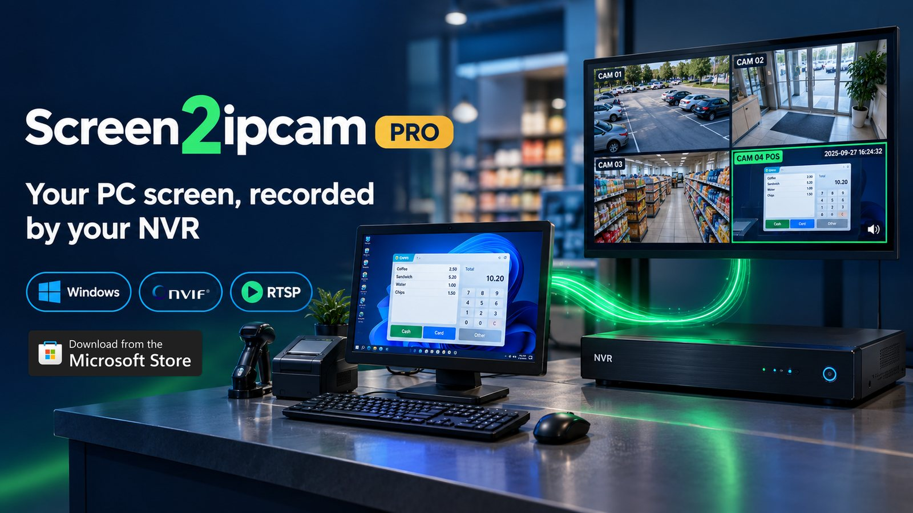
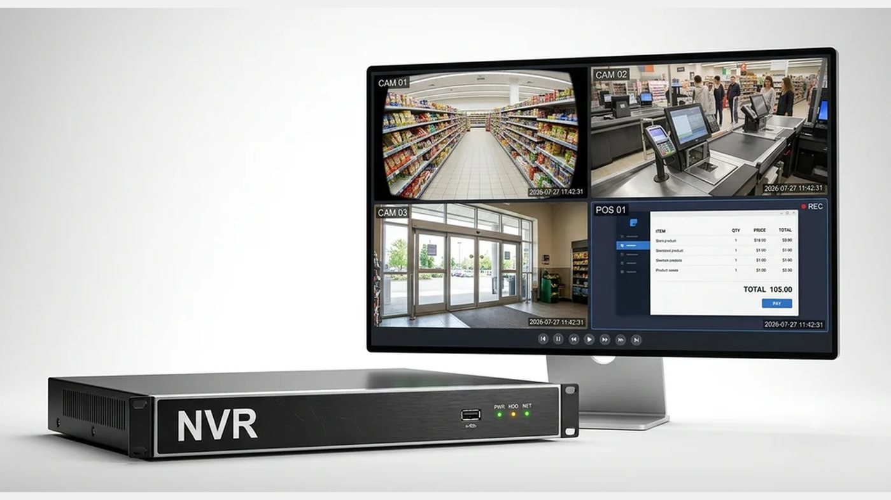
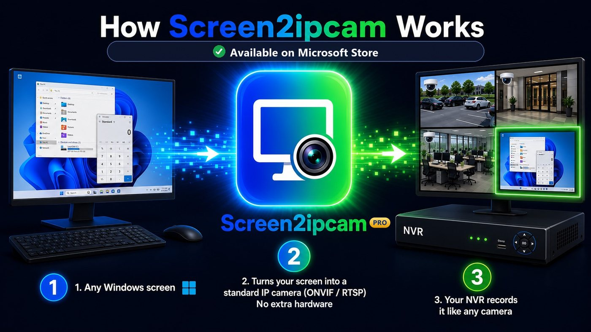
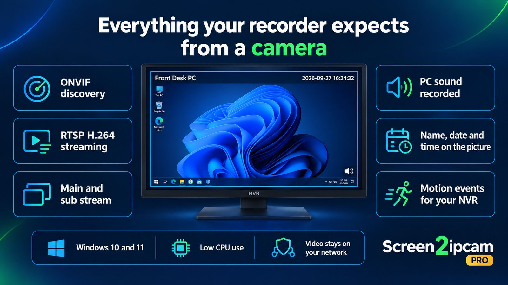
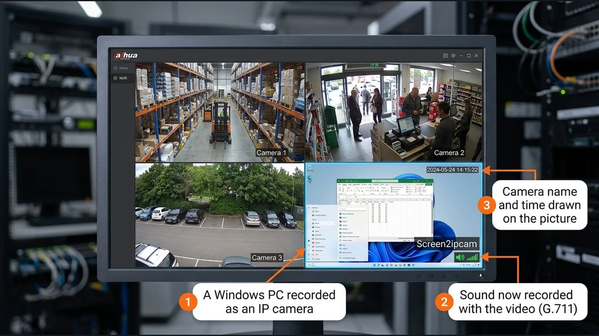

# Screen2ipcam Pro

**Turn your Windows PC or POS screen into an IP camera your NVR records.**

---

## See every sale, not just the counter

Your counter camera shows the customer. It can't show what was typed at the till.

Screen2ipcam Pro records the **POS / cashier screen** as its own camera channel, **right next to your store cameras, on the same NVR, with the same time on both**. When a customer questions a price, a refund goes missing or a total looks wrong, you open the recording and see exactly what was on the screen at that moment.

**What store owners use it for**

- Review sales, refunds and voided items against the counter camera
- Settle customer complaints with the screen and the counter side by side
- Spot cashier mistakes before they become a habit
- Keep a recorded history of any PC: reception, back office, dashboards, digital signage

## No capture card. No encoder. No extra box.

It's software. Install it on the PC and your recorder adds the screen like any other camera. No HDMI splitters, no capture cards, no new cables back to the recorder.

## Everything your recorder expects from a camera

- **Found automatically over ONVIF**, or add it by IP
- **RTSP H.264**, main stream for recording and sub stream for live view
- **PC sound** recorded with the video
- **Camera name, date and time** drawn on the picture
- **Motion events**, so your recorder can record only when the screen changes
- **Light on the PC**: low CPU use, so the till keeps doing its real job
- **Private by design**: the video goes from the PC to your recorder over your own network. It is never sent to us.

Works with **Hikvision, Dahua, Uniview, XMEye, Blue Iris** and other ONVIF or RTSP recorders and VMS software.

## Buy with confidence, through Microsoft

Screen2ipcam Pro is sold and delivered through the **Microsoft Store**, so you're covered by Microsoft from download to payment:

- **Secure checkout by Microsoft.** You pay with your Microsoft account. Your card details go to Microsoft, never to us.
- **Reviewed by Microsoft** before it was published on the Store.
- **Clean install and automatic updates** from the Microsoft Store, no setup files from unknown websites.
- **Your plan follows your Microsoft account.** Moved to a new PC? Install it with the same account and press *Restore purchase*.
- **Manage or cancel the Yearly plan** any time in your [Microsoft account](https://account.microsoft.com/services).

## Try it free for 14 days

Every feature is unlocked during the trial. When you're happy, choose a plan inside the app:

| Plan | What you get |
|---|---|
| **Free 14-day trial** | Everything, to test with your own recorder |
| **Yearly plan** | One year of Screen2ipcam Pro, renews through your Microsoft account |
| **Golden License · Lifetime activation** | Pay once, no renewals, works offline too |

The Microsoft Store shows the price in your local currency.

## Setup and support

- **Setup guide:** [docs/SETUP.md](docs/SETUP.md) (also online at [screen2ipcam.com/pro/guide](https://screen2ipcam.com/pro/guide))
- **Installing on several POS PCs:** one command with winget, see [docs/SETUP.md](docs/SETUP.md#installing-on-several-pos-pcs)
- **Troubleshooting:** [docs/SETUP.md#troubleshooting](docs/SETUP.md#troubleshooting)
- **Found a problem or want a feature?** [Open an issue](../../issues/new/choose) and tell us your recorder brand.
- **Email:** support@screen2ipcam.com
- **Website:** [screen2ipcam.com/pro](https://screen2ipcam.com/pro)

## Requirements

- Windows 10 version 1809 or later, or Windows 11 (64-bit)
- The PC and the recorder on the same local network
- Internet during the free trial

---

Screen2ipcam Pro by MagicWeb.win. Use it only to monitor screens you own or are allowed to monitor. Hikvision, Dahua, Uniview, XMEye, Blue Iris, ONVIF, Windows and Microsoft are trademarks of their respective owners. © 2026 MagicWeb.win. All rights reserved.
